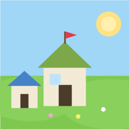
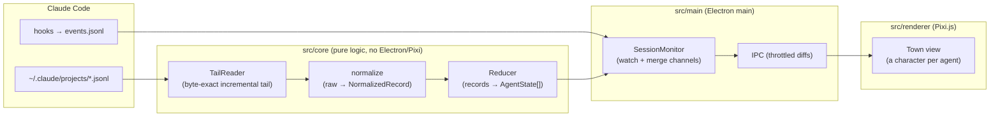

<div align="center">



# Agentville 🏘️

**A live, top-down town view of what your Claude Code agents are doing — _right now_.**

Every agent becomes a little villager. The main session is the **mayor** in the town hall;
each sub-agent is a character around the central square whose role
(🏗️ builder · 🔍 reviewer · 📐 architect · 📚 researcher) shows in what they carry.
Watch them work, finish (✅), and head home to sleep and dream 💭 — with day/night cycles
and live weather over the village.

<br/>

[](https://www.typescriptlang.org/)
[](https://www.electronjs.org/)
[](https://pixijs.com/)
[](vscode-extension/)
[](#-license)
[](#-roadmap)
[](#-privacy--safety)

</div>

---

> [!NOTE]
> Agentville is a **passive, read-only observer**. It watches Claude Code's local
> session files to visualize agent activity — it never modifies your conversations,
> interferes with Claude Code, or sends anything over the network (other than an
> optional, keyless weather lookup for your chosen city).

## 📖 Table of Contents

- [What is Agentville?](#-what-is-agentville)
- [Features](#-features)
- [Agent States](#-agent-states)
- [How It Works](#-how-it-works)
- [Architecture](#-architecture)
- [Getting Started](#-getting-started)
- [Optional: Enable the Hooks Channel](#-optional-enable-the-hooks-channel)
- [Project Structure](#-project-structure)
- [Tech Stack](#-tech-stack)
- [Roadmap](#-roadmap)
- [Privacy & Safety](#-privacy--safety)
- [License](#-license)

## 🏘️ What is Agentville?

When you run Claude Code, the main session often spawns **sub-agents** (via the `Task`
tool) that work in parallel — researching, drafting, reviewing, building. It can be hard
to see, at a glance, how many agents are running, what each one is doing, and when they
start or finish.

**Agentville turns that invisible swarm into a tiny, living town.** Each agent is a
character living around a central square. When an agent is idle it rests at home; when it
goes to work it walks into the square carrying a role-specific prop and shows a thought
bubble with its current task. The goal is **visual at-a-glance visibility** into a
Claude Code conversation — without heavy graphics and without any official integration.

Conceptually it's a sibling of **Claude Code Nonstop** — both are external tools that
observe and/or augment Claude Code.

## ✨ Features

- 🧑‍🌾 **A character per agent** — placed around the central square; the main session is
  the **mayor** in the town hall.
- 🛠️ **Roles from context** — each villager's prop is derived from the agent type + task:
  🏗️ builder (a growing structure + hammer) · 🔍 reviewer (magnifying glass) ·
  📐 architect (notebook + pencil) · 📚 researcher (book) · 🏛️ mayor (scroll).
- 💬 **Task speech bubbles** — the agent's `description` floats above it while it works.
- 🪧 **Village tabs** — signposts hop between the other Claude conversations of the
  **same project** (each its own "village"), colour-coded, with an optional manual name.
- 🌅 **Day/night cycle** — the sky reflects your local time: dawn / day / dusk / night,
  with a sun arc, moon, and stars; a global tint sets the whole village's mood.
- 🌦️ **Live weather** — real weather for a city you choose (keyless, via Open-Meteo):
  rain / snow / fog / clouds / storm — or pick a mode manually.
- 🐑 **Cute life** — farm animals, birds, a flowing river with jumping fish, fruit trees,
  and street lamps that light up in the evening.
- 💤 **Sleep & dreams** — idle agents go home, breathe, and occasionally pop a dream bubble.
- 🖥️ **Runs two ways** — as a standalone Electron app **or** inside a VS Code tab via the
  bundled extension (with a 🌍 button injected into the Claude Code panel).

> 📸 _Screenshots/GIF coming soon — drop a `docs/` capture here once the visual MVP is recorded._

## 🚦 Agent States

Agentville derives and renders the full agent lifecycle. States come from two channels
that merge together (see [How It Works](#-how-it-works)):

| State | Icon | Meaning | Source |
| --- | :---: | --- | --- |
| **idle** | 🏠 | Resting at home — no recent activity | JSONL (time threshold) / hooks (`idle_prompt`, certain) |
| **working** | 🏭 | Actively working, with a task bubble | JSONL (open tool uses) + hooks (`SubagentStart`) |
| **awaitingApproval** | ⏳ | Waiting for the user to approve a permission | hooks only (`Notification:permission_prompt` / `PermissionRequest`) |
| **done** | ✅ | Sub-agent finished and went home | JSONL (`status: completed`) / hooks (`SubagentStop`) |
| **error** | ⚠️ | Hit an API error | JSONL (`isApiErrorMessage`) / hooks (`StopFailure`) |
| **rateLimited** | 😴 | Waiting out a rate limit | hooks (`StopFailure.error_type`) |

## 🔍 How It Works

Claude Code records each conversation as JSONL files under
`~/.claude/projects/<encoded-path>/*.jsonl`, including calls to the `Task` tool that spawn
sub-agents. Agentville **tails those files** and derives a real-time feed of agent state —
**no official API required**.

There are **two data channels that merge** into a single source of truth:

1. **📄 JSONL channel (always available).** Incremental, byte-exact tailing of the session
   files → parse → normalize → reduce into agent states. This gives the **task description**
   for the speech bubble (which the hooks channel does *not* carry) and works with zero setup.

2. **🪝 Hooks channel (optional, opt-in).** Claude Code's official hooks
   (`SubagentStart` / `SubagentStop` / `Notification` / `PermissionRequest` / `StopFailure`)
   write events to a file that Agentville reads. This turns several core states from
   "fragile probabilistic guesses from JSONL" into **certain events** — most notably
   ⏳ *awaiting-approval* and the "silence ≠ idle" problem.

When hooks aren't installed, Agentville **falls back gracefully** to JSONL-only mode (with
reduced certainty on a couple of edge states). The design treats the two channels as a
core merge — the hook provides certain id / type / lifecycle / timing, while JSONL provides
the task text.

## 🏗️ Architecture



The **core** (`src/core`) is pure, framework-free TypeScript — tail, parse, normalize,
reduce — fully unit-tested and validated end-to-end against real sessions during a
[Phase 0 spike](SPIKE-FINDINGS.md). The **main** process watches files and merges the two
channels; the **renderer** draws the town with Pixi.js and updates from throttled diffs
over IPC.

> The core was hardened by a spike that caught and fixed 3 real bugs (false error/rate-limit
> matches from conversation text, idle↔working flicker from backlog timestamps, and
> agent-creation diffs being swallowed). See [`SPIKE-FINDINGS.md`](SPIKE-FINDINGS.md).

## 🚀 Getting Started

### Prerequisites

- **Node.js ≥ 20**
- **Claude Code** installed and used at least once (so `~/.claude/projects/…` exists)

### Option A — Standalone Electron app

```bash
git clone https://github.com/orbenozio/claude-code-agentville.git
cd claude-code-agentville
npm install

# build + launch the town
npm start
```

Other useful scripts:

```bash
npm run spike            # run the core feed live against your real sessions (console)
npm run spike:replay -- <file.jsonl>   # replay a recorded session deterministically
npm run typecheck        # tsc --noEmit
npm test                 # run the core unit tests
npm run build            # bundle without launching
```

### Option B — VS Code extension

Opens the town in a VS Code tab, with a 🌍 button injected into the Claude Code panel
footer and a status-bar item — no separate app to install.

```bash
cd vscode-extension
npm install
npm run build   # esbuild bundle (vscode:prepublish)
```

Then install the packaged `.vsix` via **Extensions → … → Install from VSIX**, or copy the
folder to `~/.vscode/extensions/orbenozio.agentville-launcher-<version>/` and reload the
window. Open it three ways: the **🌍 globe button** in the Claude panel, the **status-bar
item**, or the command palette → **"Agentville: Open the town view"**.

See [`vscode-extension/README.md`](vscode-extension/README.md) for full extension docs.

## 🪝 Optional: Enable the Hooks Channel

Installing the hooks unlocks the ⏳ *awaiting-approval* state and certain idle/error
detection. It's a one-time, opt-in change to your Claude Code settings.

> [!WARNING]
> Adding hooks to your **user-level** `~/.claude/settings.json` affects **every** Claude
> Code session. Prefer project-level settings if you only want it for one project. The
> Agentville hook is passive — it reads stdin, appends to its own event file, and always
> exits 0.

Add to `settings.json` (replace `<repo>` with the absolute path to this checkout):

```json
{
  "hooks": {
    "SubagentStart":     [{ "matcher": "*", "hooks": [{ "type": "command", "command": "node <repo>/hooks/agentville-hook.mjs", "async": true }] }],
    "SubagentStop":      [{ "matcher": "*", "hooks": [{ "type": "command", "command": "node <repo>/hooks/agentville-hook.mjs", "async": true }] }],
    "Notification":      [{ "matcher": "*", "hooks": [{ "type": "command", "command": "node <repo>/hooks/agentville-hook.mjs", "async": true }] }],
    "PermissionRequest": [{ "matcher": "*", "hooks": [{ "type": "command", "command": "node <repo>/hooks/agentville-hook.mjs", "async": true }] }],
    "StopFailure":       [{ "matcher": "*", "hooks": [{ "type": "command", "command": "node <repo>/hooks/agentville-hook.mjs", "async": true }] }]
  }
}
```

## 📁 Project Structure

```
claude-code-agentville/
├── src/
│   ├── core/          # Pure logic: TailReader, normalize, Reducer, types (+ tests)
│   ├── main/          # Electron main: SessionMonitor (channel merge), IPC, preload
│   ├── renderer/      # Pixi.js town view (renderer.ts + index.html)
│   └── spike/         # Phase-0 verification harnesses (live / replay / tail / hooks)
├── hooks/             # agentville-hook.mjs — passive Claude Code hook script
├── vscode-extension/  # VS Code extension: opens the town in a tab + 🌍 panel button
├── scripts/           # build.mjs / launch.mjs
├── CONCEPT.md         # Original concept
├── SPEC.md            # Full technical specification (binding)
├── JSONL-FINDINGS.md  # Verified findings about Claude Code's JSONL format
├── SPIKE-FINDINGS.md  # Phase-0 spike results (core validated end-to-end)
└── TASKS.md           # Live task tracker / phase map
```

## 🧰 Tech Stack

| Layer | Choice | Why |
| --- | --- | --- |
| Desktop container | **Electron** (LTS, Node ≥ 20) | Full-power Node `fs`/threads for tailing & watching |
| Render engine | **Pixi.js v8** (WebGL/WebGPU → Canvas fallback) | Fast, lightweight 2D sprites & animation |
| Language | **TypeScript** | Types on the state model & schema are critical for version-forgiveness |
| Validation | **Zod** | Boundary validation of forgiving, evolving JSONL/hook shapes |
| File watching | **chokidar** | Cross-platform file watching |
| Bundler | **esbuild** | Fast builds for app + extension |

## 🗺️ Roadmap

The project follows a phased plan (see [`TASKS.md`](TASKS.md) for the live tracker):

- ✅ **Phase 0 — Core spike**: tail + parser + reducer validated against real data, both
  channels (JSONL + hooks) proven mechanically.
- ✅ **Phase 1 — Visual MVP**: Electron + Pixi, a living town with a character per agent,
  task bubbles, and state transitions.
- 👉 **Phase 2 — Edge states**: ⚠️ error & 😴 rate-limit visuals + tail robustness
  (throttled IPC, rotation detection, idempotent activity).
- ⬜ **Phase 3 — Permissions**: ⏳ awaiting-approval + certain idle via the hooks channel,
  with an idempotent install wizard.
- ⬜ **Phase 4 — Polish**: project picker, multi-project support, "jump to conversation".

## 🔒 Privacy & Safety

- **Read-only by design.** Agentville is a passive observer. It never writes to or modifies
  your Claude Code conversations, and never sends them anywhere.
- **MVP is view-only.** The architecture is *control-ready* (an isolated `CommandBus`), but
  no control actions (stopping agents, approving permissions) are implemented — eliminating
  any risk of disrupting a live session.
- **Local-first.** The only outbound request is an optional, keyless weather lookup for a
  city you explicitly choose.

## 📄 License

MIT — see [`LICENSE`](LICENSE). Copyright (c) 2026 Or Benozio.

---

<div align="center">
<sub>Built as a little window into the swarm. 🏘️</sub>
</div>
